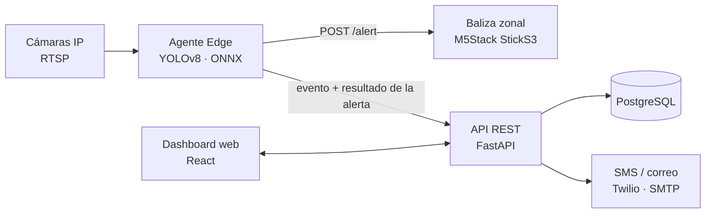

# CascoVision

**Sistema de detección automatizada de EPP mediante visión computacional**
Proyecto APT · Capstone PTY4614 · Duoc UC · 2026.02 · Equipo 1 (sección 802D)

> 🚧 **Estado:** Fase 2, desarrollo. Análisis de requerimientos (SRS v0.1) en revisión; construcción desde la semana 9.

---

## Descripción

**Qué hace.** CascoVision usa las **cámaras IP que la faena ya tiene instaladas** para detectar automáticamente a las personas que no llevan **casco de seguridad o chaleco reflectante** dentro de una zona de riesgo. Ante cada infracción:

1. registra el incidente con evidencia fotográfica (rostros difuminados);
2. activa una **baliza zonal** que emite una alerta sonora y visual en el mismo sector;
3. notifica al prevencionista de riesgos por SMS y correo;
4. muestra el incidente en un dashboard web con historial y reportes.

**A quién va dirigido.** A empresas constructoras, en particular a los **prevencionistas de riesgos** y jefes de terreno.

**Qué problema resuelve.** La construcción tiene una de las tasas de accidentabilidad más altas de Chile, y no usar el EPP es una causa evitable. Un prevencionista no puede vigilar todos los frentes de la faena a la vez, y cada infracción arriesga multas de **1 a 150 UTM**. CascoVision convierte la supervisión de **reactiva** a **preventiva y en tiempo real**, y lo hace **sin identificar a los trabajadores**: detecta objetos, no personas, y todo el procesamiento es local.

## Tecnologías

| Capa | Tecnología |
| --- | --- |
| Visión computacional | Python · YOLOv8 (Ultralytics) · ONNX Runtime · OpenCV |
| Captura de video | Cámaras IP · RTSP / ONVIF |
| Backend | FastAPI (Python) |
| Base de datos | PostgreSQL |
| Frontend | React.js |
| Alerta física | M5Stack StickS3 (ESP32-S3) · HTTP en la red local |
| Notificaciones | Twilio (SMS) · SMTP (correo) |
| Despliegue | Docker · Docker Compose (on-premise, sin nube) |

## Arquitectura



- El **agente Edge** analiza 1 cuadro por segundo por cámara y verifica si la persona sin EPP está dentro de una zona de riesgo. Si lo está, **activa directamente la baliza de la zona** (`POST /alert` con token) y luego envía el evento a la API.
- La **API** registra el incidente y el resultado de la alerta física, y notifica al prevencionista. La orden a la baliza no pasa por la API: así la alerta es más rápida y funciona aunque la API esté caída.
- Todo el software corre en contenedores Docker dentro de la red de la faena: **el video no sale de la obra**.
- Latencia objetivo desde la detección hasta la alerta en la baliza: **menos de 5 segundos**.

## Ejecución local

> ⚠️ **Todavía no es ejecutable.** El `docker-compose.yml` y el código de `src/` se construyen entre las semanas 9 y 13 (tareas 4.2 a 4.11 de la Gantt); hoy `src/` y `tests/` solo tienen la estructura de carpetas. Los comandos siguientes son los previstos para cuando exista el `docker-compose.yml`.

Requisitos: [Docker](https://www.docker.com/) y Docker Compose.

```bash
git clone https://github.com/lonelystar16/AV_AldoMartinez802D_Equipo1.git
cd AV_AldoMartinez802D_Equipo1
cp .env.example .env        # completar las variables
docker compose up -d
```

| Servicio | URL |
| --- | --- |
| Dashboard | http://localhost:3000 |
| API (documentación) | http://localhost:8000/docs |

## Modelo de detección

El modelo YOLOv8 entrenado se versiona en [`models/`](models/) junto con sus métricas de validación (criterio de aceptación: mAP@0,5 ≥ 0,90 y *recall* ≥ 0,85, RNF-05 del SRS). Es la única excepción a la regla de `.gitignore` que excluye `*.pt` y `*.onnx`: un YOLOv8n o YOLOv8s pesa entre 6 y 25 MB, por debajo del límite de 100 MB de GitHub.

## Equipo

| Integrante | Rol | Responsabilidades |
| --- | --- | --- |
| Iahn Vera | Jefe de proyecto / IA | Gestión, modelo YOLOv8, agente Edge |
| Joaquín Armijo | Backend y datos | Modelo de datos, API REST, Docker |
| Benjamín Cáceres | Frontend y reportería | Dashboard, alertas remotas, reportes |
| Fernando Muñoz | IoT y pruebas | Baliza zonal (firmware), plan de pruebas |

## Metodología

**Tradicional en cascada.** El proyecto avanza por fases secuenciales, y cada una cierra con un entregable aprobado (puerta de fase):

| Fase | Semanas | Entregable |
| --- | --- | --- |
| Inicio y planificación | 1–4 | Definición del proyecto y carta Gantt |
| Análisis de requerimientos | 5–7 | D1 · Documento de requerimientos (SRS) |
| Diseño | 8–9 | D2 · Documento de diseño y plan de pruebas |
| Construcción | 9–13 | Componentes con pruebas unitarias y Docker |
| Integración y pruebas | 13–15 | D3 · Plan de pruebas y evidencias |
| Implantación y cierre | 14–15 | D4 · Manual técnico e informe final |
| Presentación | 16–18 | Defensa |

Las fases se solapan de forma controlada en las semanas 9, 13 y 14–15: una tarea solo empieza antes si no depende del entregable pendiente (por ejemplo, el dataset no depende del documento de diseño). La carta Gantt detallada está en [`Fase 2/Evidencias Grupales/`](Fase%202/Evidencias%20Grupales/).

## Estructura del repositorio

```
├── Fase 1/                 Evidencias de la definición del proyecto
├── Fase 2/
│   ├── Documentacion/      D1 SRS · D2 Diseño · D3 Pruebas · D4 Manual técnico
│   ├── Evidencias Grupales/
│   └── Evidencias Individuales/
├── Fase 3/                 Presentación final
├── src/
│   ├── api/                API REST (FastAPI)
│   ├── edge/               Agente Edge (visión computacional)
│   ├── dashboard/          Dashboard web (React)
│   └── firmware/           Firmware de la baliza zonal
├── models/                 Modelo YOLOv8 entrenado (.onnx / .pt) y sus métricas
├── db/                     Migraciones y esquema de la base de datos
├── tests/                  Pruebas automatizadas
└── docs/diagramas/         Diagramas UML y de arquitectura
```
